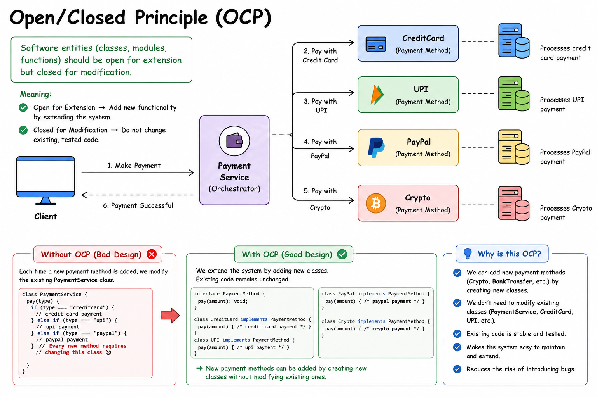

# Open/Closed Principle (OCP)

<p align="center">
  
</p>

---

## 📖 Definition

The **Open/Closed Principle (OCP)** states:

> **Software entities (classes, modules, functions, etc.) should be open for extension but closed for modification.**

In simple terms:

- ✅ **Open for Extension** → Add new functionality by extending the code.
- ✅ **Closed for Modification** → Do not modify existing, tested code.

---

# 🎯 What Does OCP Mean?

Instead of changing existing classes whenever a new feature is required, create **new classes** that extend the existing behavior.

This keeps the current code stable and reduces the risk of introducing bugs.

---

# 💳 Payment System Example

Consider an online payment system.

Instead of writing one class that handles every payment method using multiple `if-else` statements, create a separate class for each payment method.

| Class | Responsibility |
|--------|----------------|
| `PaymentService` | Coordinates the payment process |
| `CreditCard` | Processes credit card payments |
| `UPI` | Processes UPI payments |
| `PayPal` | Processes PayPal payments |
| `Crypto` | Processes cryptocurrency payments |

When a new payment method is introduced, simply create another class.

Existing classes remain unchanged.

---

# 🔄 Workflow

1. Client sends a payment request.
2. `PaymentService` receives the request.
3. Appropriate payment class is selected.
4. Payment is processed.
5. Success response is returned.

---

# ❌ Without OCP

```javascript
class PaymentService {
    pay(type) {
        if (type === "creditcard") {
            // Credit Card Logic
        }
        else if (type === "upi") {
            // UPI Logic
        }
        else if (type === "paypal") {
            // PayPal Logic
        }
    }
}
```

### Problem

Whenever a new payment method is added:

- Apple Pay
- Crypto
- Net Banking

You must modify the existing `PaymentService` class.

This violates the **Open/Closed Principle**.

---

# ✅ With OCP

```text
                PaymentMethod
                     │
        ┌────────────┼────────────┐
        │            │            │
   CreditCard       UPI        PayPal
                                 │
                              Crypto
```

Each payment method is implemented in its own class.

Adding a new payment method only requires creating a **new class**, without changing existing ones.

---

# ✅ Benefits

- Easy to extend
- Existing code remains untouched
- Reduces bugs
- Easier maintenance
- Easier testing
- Better scalability
- Cleaner architecture

---

# 📌 Interview Definition

> **The Open/Closed Principle (OCP) states that software entities such as classes, modules, and functions should be open for extension but closed for modification. New functionality should be added by extending existing code rather than modifying tested code.**

---

# 🧠 Easy Way to Remember

> **Extend Existing Code, Don't Modify Existing Code**

---

# 💡 Real-Life Example

Imagine Amazon initially supports:

- Credit Card
- UPI

Later, it wants to support:

- PayPal
- Apple Pay
- Crypto

Instead of modifying the existing payment logic, Amazon simply adds a new payment class for each new payment method.

Existing code remains unchanged.

This is the **Open/Closed Principle**.

---

# 📚 SOLID Principles

- **S** – Single Responsibility Principle
- **O** – Open/Closed Principle
- **L** – Liskov Substitution Principle
- **I** – Interface Segregation Principle
- **D** – Dependency Inversion Principle
