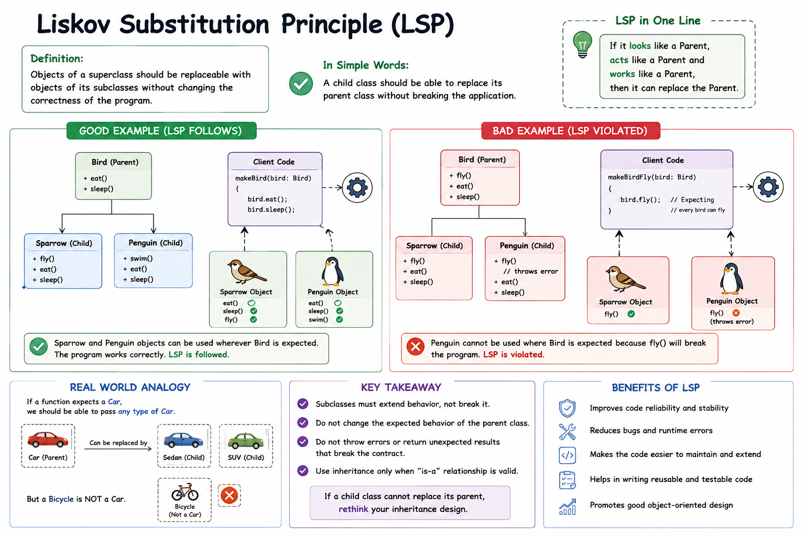

# Liskov Substitution Principle (LSP)

<p align="center">
  
</p>

---

## 📖 Definition

The **Liskov Substitution Principle (LSP)** states:

> **Objects of a superclass should be replaceable with objects of its subclasses without affecting the correctness of the program.**

In simple terms:

- ✅ A child class should be able to replace its parent class.
- ✅ The application should continue to work correctly.
- ❌ A child class should never break the expected behavior of the parent class.

---

# 🎯 What Does LSP Mean?

A subclass should behave like its parent class.

If your code expects a parent object, you should be able to pass any child object without modifying the code or causing errors.

---

# 🐦 Bird Example

Consider the following hierarchy:

| Class | Responsibility |
|--------|----------------|
| `Bird` | Base class |
| `Sparrow` | Can fly and behaves like Bird |
| `Penguin` | Cannot fly but is still a Bird |

If the application expects a `Bird`, replacing it with a `Sparrow` should work perfectly.

Replacing it with a `Penguin` should also work **only if** the parent class does not assume every bird can fly.

---

# ✅ Good Design (Follows LSP)

```text
Bird
│
├── Sparrow
│
└── Penguin
```

Both classes can replace `Bird` because the parent only contains behavior common to all birds.

---

# ❌ Bad Design (Violates LSP)

```javascript
class Bird {
    fly() {
        console.log("Flying...");
    }
}

class Penguin extends Bird {
    fly() {
        throw new Error("Penguins can't fly!");
    }
}
```

### Problem

The application expects every `Bird` to fly.

When a `Penguin` is substituted, the program crashes.

This violates the **Liskov Substitution Principle**.

---

# ✅ Better Design

```text
Bird
│
├── FlyingBird
│      │
│      └── Sparrow
│
└── Penguin
```

Now:

- `FlyingBird` contains `fly()`.
- `Penguin` does not inherit `fly()`.
- Every subclass behaves correctly.

---

# 🔄 Workflow

1. Client requests a `Bird`.
2. Application receives a subclass (`Sparrow` or `Penguin`).
3. The subclass behaves according to the parent's contract.
4. The application works without modification.

---

# 🚗 Real-World Example

Suppose a function expects a `Car`.

Valid substitutions:

- Sedan
- SUV
- Hatchback

Invalid substitution:

- Bicycle ❌

A bicycle cannot replace a car because it does not satisfy the same behavior.

---

# ✅ Benefits

- Improves code reliability.
- Prevents runtime errors.
- Encourages proper inheritance.
- Makes code reusable.
- Easier testing.
- Easier maintenance.
- Better object-oriented design.

---

# 📌 Interview Definition

> **The Liskov Substitution Principle (LSP) states that objects of a superclass should be replaceable with objects of its subclasses without changing the correctness of the program. A child class should preserve the expected behavior of its parent class.**

---

# 🧠 Easy Way to Remember

> **Replace Parent with Child → Application Should Still Work**

or

> **Child should behave like Parent.**

---

# 💡 Real-Life Analogy

Imagine a parking system that accepts any **Car**.

You can park:

- 🚗 Sedan
- 🚙 SUV
- 🚘 Hatchback

But you cannot replace a **Car** with a **Bicycle** because the parking system expects a vehicle with car-like behavior.

Similarly, in software, every child class should be able to replace its parent without breaking the application.

---

# 📚 SOLID Principles

- **S** – Single Responsibility Principle
- **O** – Open/Closed Principle
- **L** – Liskov Substitution Principle
- **I** – Interface Segregation Principle
- **D** – Dependency Inversion Principle
