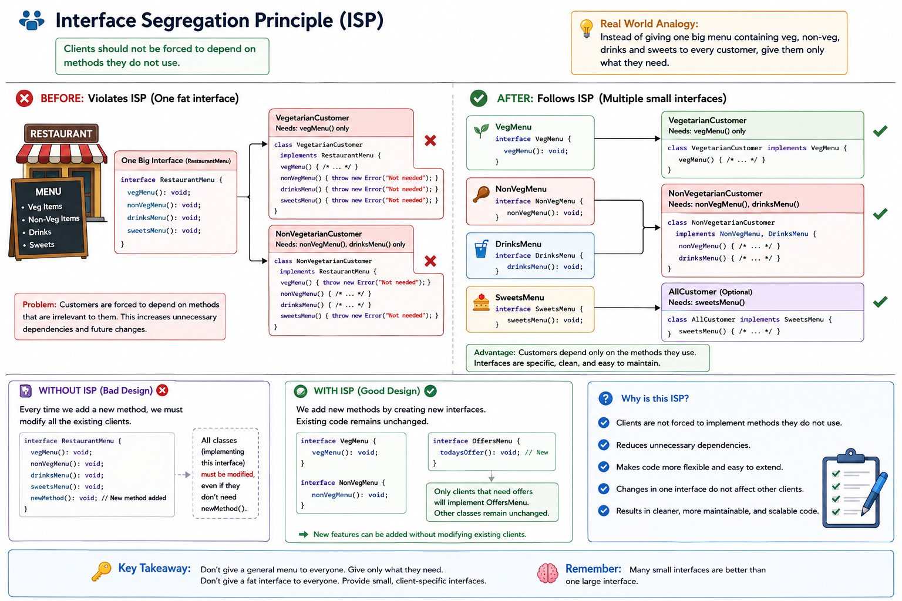

# Interface Segregation Principle (ISP)

<p align="center">
  
</p>

---

# 📖 Definition

The **Interface Segregation Principle (ISP)** states:

> **Clients should not be forced to depend on methods they do not use.**

Instead of creating **one large interface**, create **multiple small, client-specific interfaces**.

---

# 🎯 What Does ISP Mean?

A class should implement **only the methods it actually needs**.

If an interface contains methods that are irrelevant to a class, split it into smaller interfaces.

---

# 🍽️ Restaurant Example

Imagine a restaurant.

The restaurant has:

- 🥗 Vegetarian Menu
- 🍗 Non-Vegetarian Menu
- 🥤 Drinks Menu
- 🍰 Sweets Menu

### ❌ Bad Design

The waiter gives **one big menu** containing all items to every customer.

A vegetarian customer only wants vegetarian food, but still receives:

- Non-Veg Menu ❌
- Drinks Menu ❌
- Sweets Menu ❌

This creates unnecessary dependency.

---

### ✅ Good Design

Instead of one large menu, create separate menus.

| Interface | Responsibility |
|-----------|----------------|
| `VegMenu` | Shows vegetarian items |
| `NonVegMenu` | Shows non-vegetarian items |
| `DrinksMenu` | Shows drinks |
| `SweetsMenu` | Shows sweets |

Now:

- Vegetarian customers receive only the **Veg Menu**.
- Non-vegetarian customers receive only the **Non-Veg Menu** and **Drinks Menu**.
- Dessert customers receive only the **Sweets Menu**.

Each customer depends only on the interfaces they need.

---

# 🔄 Workflow

1. Customer enters the restaurant.
2. Customer specifies their preference.
3. Restaurant provides only the required menu.
4. Customer places an order.
5. Restaurant prepares the order.

---

# ❌ Without ISP

```javascript
interface RestaurantMenu {
    vegMenu();
    nonVegMenu();
    drinksMenu();
    sweetsMenu();
}
```

Every customer must implement all methods.

Example:

```javascript
class VegetarianCustomer implements RestaurantMenu {
    vegMenu(){}

    nonVegMenu(){
        throw new Error("Not Needed");
    }

    drinksMenu(){
        throw new Error("Not Needed");
    }

    sweetsMenu(){
        throw new Error("Not Needed");
    }
}
```

### Problem

The customer is forced to depend on methods that are irrelevant.

This violates the **Interface Segregation Principle**.

---

# ✅ With ISP

```text
                 VegMenu
                    │
         Vegetarian Customer

-----------------------------------

              NonVegMenu
                    │
          NonVegetarian Customer

-----------------------------------

              DrinksMenu
                    │
          NonVegetarian Customer

-----------------------------------

              SweetsMenu
                    │
          Dessert Customer
```

Each customer implements only the interfaces they need.

---

# ✅ Benefits

- Small and focused interfaces
- No unnecessary methods
- Easier maintenance
- Better readability
- More reusable code
- Easier testing
- Better scalability

---

# 📌 Interview Definition

> **The Interface Segregation Principle (ISP) states that clients should not be forced to depend on methods they do not use. Instead of creating one large interface, we should create multiple small, client-specific interfaces so that each class implements only the functionality it requires.**

---

# 💡 Real-World Analogy

Imagine visiting a restaurant.

Instead of receiving one huge menu containing:

- Vegetarian
- Non-Vegetarian
- Drinks
- Desserts

You receive only the menu relevant to your needs.

For example:

- A vegetarian customer receives only the **Vegetarian Menu**.
- A dessert customer receives only the **Dessert Menu**.

This avoids unnecessary choices and keeps things simple.

The same idea applies to software—classes should only depend on the methods they actually use.

---

# 🧠 Easy Way to Remember

> **Don't force clients to implement methods they don't need.**

or

> **Many Small Interfaces > One Large Interface**

---

# 📚 SOLID Principles

- **S** – Single Responsibility Principle
- **O** – Open/Closed Principle
- **L** – Liskov Substitution Principle
- **I** – Interface Segregation Principle
- **D** – Dependency Inversion Principle
