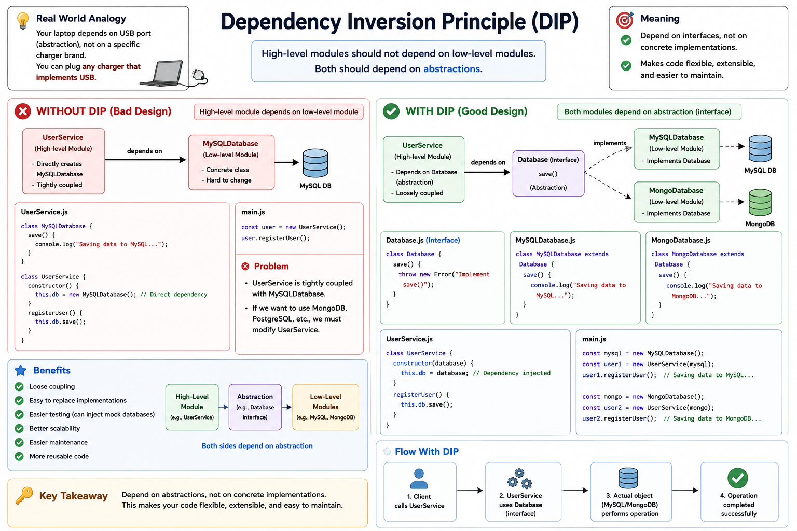

# Dependency Inversion Principle (DIP)

<p align="center">
  
</p>

---

# 📖 Definition

The **Dependency Inversion Principle (DIP)** states:

> **High-level modules should not depend on low-level modules. Both should depend on abstractions.**

It also states:

> **Abstractions should not depend on details. Details should depend on abstractions.**

---

# 🎯 What Does DIP Mean?

Instead of directly depending on concrete classes (like `MySQLDatabase`), high-level modules should depend on an **abstraction (interface)**.

This makes the system flexible, loosely coupled, and easier to extend.

---

# 🗄️ Database Example

Suppose we have a user registration system.

### Components

| Class | Responsibility |
|--------|----------------|
| `UserService` | Handles user registration |
| `Database` | Defines the database abstraction |
| `MySQLDatabase` | Saves data to MySQL |
| `MongoDatabase` | Saves data to MongoDB |

Instead of `UserService` creating a `MySQLDatabase` directly, it depends on the `Database` abstraction.

---

# 🔄 Workflow

1. Client requests user registration.
2. `UserService` receives the request.
3. `UserService` calls the `Database` interface.
4. The selected implementation (`MySQLDatabase` or `MongoDatabase`) performs the save operation.
5. Registration is completed successfully.

---

# ❌ Without DIP (Bad Design)

```javascript
class MySQLDatabase {
    save() {
        console.log("Saving data to MySQL...");
    }
}

class UserService {
    constructor() {
        this.database = new MySQLDatabase();
    }

    registerUser() {
        this.database.save();
    }
}
```

### Problem

`UserService` directly depends on `MySQLDatabase`.

If tomorrow we switch to:

- MongoDB
- PostgreSQL
- Oracle Database

We must modify `UserService`.

This creates **tight coupling**.

---

# ✅ With DIP (Good Design)

```text
                UserService
                     │
                     ▼
            Database (Interface)
              ▲               ▲
              │               │
      MySQLDatabase    MongoDatabase
```

Now `UserService` depends only on the `Database` abstraction.

Adding a new database only requires creating another implementation.

No changes are needed in `UserService`.

---

# 💻 Example

```javascript
class UserService {
    constructor(database) {
        this.database = database;
    }

    registerUser() {
        this.database.save();
    }
}
```

```javascript
const mysql = new MySQLDatabase();
const user = new UserService(mysql);

user.registerUser();
```

Later:

```javascript
const mongo = new MongoDatabase();
const user = new UserService(mongo);

user.registerUser();
```

`UserService` remains unchanged.

---

# 💻 Folder Structure

```text
DIP/
│
├── Database.js
├── MySQLDatabase.js
├── MongoDatabase.js
├── UserService.js
└── main.js
```

---

# ✅ Benefits

- Loose Coupling
- Easy to replace implementations
- Easy testing (Mock Database)
- Better scalability
- Better maintainability
- Better code reusability
- Follows Dependency Injection

---

# 🌍 Real-World Analogy

Imagine a laptop.

The laptop connects through a **USB-C port**.

It doesn't care whether the charger is:

- Samsung Charger
- Apple Charger
- Dell Charger
- HP Charger

The laptop depends only on the **USB-C interface**, not on a specific charger brand.

Similarly, in software, `UserService` depends on the `Database` interface instead of a specific database implementation.

---

# 📌 Interview Definition

> **The Dependency Inversion Principle (DIP) states that high-level modules should not depend on low-level modules. Both should depend on abstractions. Instead of directly depending on concrete implementations, classes should depend on interfaces or abstractions, making the application loosely coupled, flexible, and easy to maintain.**

---

# 🧠 Easy Way to Remember

> **Depend on Abstractions, Not on Concrete Implementations**

or

> **High-Level → Interface ← Low-Level**

Instead of:

```text
UserService
      │
      ▼
MySQLDatabase
```

Use:

```text
              Database Interface
                ▲            ▲
                │            │
      MySQLDatabase    MongoDatabase
                ▲
                │
          UserService
```

---

# 📚 SOLID Principles

- **S** – Single Responsibility Principle
- **O** – Open/Closed Principle
- **L** – Liskov Substitution Principle
- **I** – Interface Segregation Principle
- **D** – Dependency Inversion Principle
