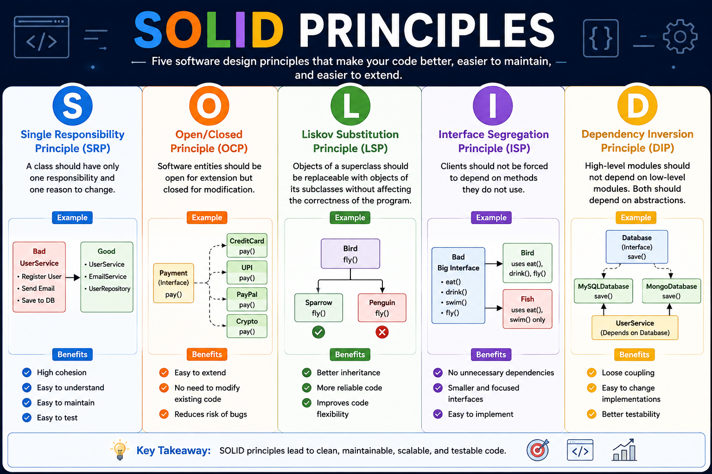

  

---

# 📖 Introduction

**SOLID** is a set of **five object-oriented design principles** introduced by **Robert C. Martin (Uncle Bob)**.

These principles help developers build software that is:

- Clean
- Maintainable
- Scalable
- Flexible
- Reusable
- Testable
- Loosely Coupled

Learning SOLID improves software architecture and helps write high-quality, production-ready code.

---

# 📚 SOLID Principles

| Principle | Description |
|-----------|-------------|
| **S** | Single Responsibility Principle |
| **O** | Open/Closed Principle |
| **L** | Liskov Substitution Principle |
| **I** | Interface Segregation Principle |
| **D** | Dependency Inversion Principle |

---

# 📑 Contents

- Single Responsibility Principle (SRP)
- Open/Closed Principle (OCP)
- Liskov Substitution Principle (LSP)
- Interface Segregation Principle (ISP)
- Dependency Inversion Principle (DIP)

---

# 🎯 What You'll Learn

- Object-Oriented Design
- Clean Code Practices
- Loose Coupling
- High Cohesion
- Dependency Injection
- Software Architecture
- Real-World Design Examples
- JavaScript Implementations
- Interview-Oriented Concepts

---

# 💡 Why Learn SOLID?

Following SOLID principles helps you:

- Write clean and readable code
- Reduce code complexity
- Improve maintainability
- Increase flexibility
- Simplify testing
- Build scalable applications
- Reduce bugs during future changes

---

# 🧠 Principles Overview

### 🔹 Single Responsibility Principle (SRP)

A class should have only **one responsibility** and **one reason to change**.

---

### 🔹 Open/Closed Principle (OCP)

Software entities should be **open for extension** but **closed for modification**.

---

### 🔹 Liskov Substitution Principle (LSP)

A subclass should be able to replace its parent class without changing the correctness of the program.

---

### 🔹 Interface Segregation Principle (ISP)

Clients should not be forced to depend on methods they do not use.

---

### 🔹 Dependency Inversion Principle (DIP)

High-level modules should depend on abstractions instead of concrete implementations.

---

# 🚀 Who Should Learn SOLID?

- Students
- Software Engineers
- Frontend Developers
- Backend Developers
- Full Stack Developers
- Java Developers
- JavaScript Developers
- C++ Developers
- Anyone preparing for Software Engineering interviews

---

# ⭐ Key Takeaway

> **Write code that is easy to extend, maintain, test, and understand—not code that is difficult to modify in the future.**

---

# 👨‍💻 Author

**Jeevan Kumar**

- GitHub: https://github.com/jeevankumar812
- LinkedIn: https://www.linkedin.com/in/jeevankumar812/

---

# 📄 License

Licensed under the **MIT License**.
